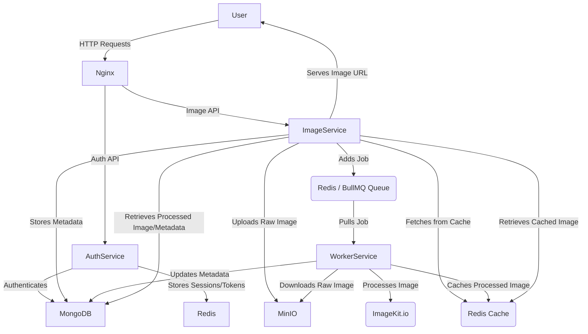

# PixForge


A scalable and distributed image processing microservice system designed to handle image uploads, transformations, and management with robust authentication.

[](https://github.com/Debanjan2007/PixForge/actions)
[](https://github.com/Debanjan2007/PixForge/coverage)
[](https://github.com/Debanjan2007/PixForge/releases)
[](LICENSE)
[](https://github.com/Debanjan2007/PixForge/issues)

## 📖 Overview

PixForge is a modern, microservice-based image processing platform that provides a comprehensive solution for managing and transforming images. It breaks down a monolithic architecture into specialized services for authentication, image handling, and background processing, ensuring high scalability and maintainability.

**Key Value Proposition:**
*   **Scalable Architecture**: Built with microservices, allowing individual components to scale independently.
*   **Robust Authentication**: Secure user management with JWT-based authentication.
*   **Efficient Image Handling**: Utilizes MinIO (S3-compatible) for raw image storage and ImageKit.io for advanced processing and delivery.
*   **Asynchronous Processing**: Background workers powered by BullMQ ensure non-blocking image transformations.
*   **Caching**: Leverages Redis for faster data retrieval and improved API response times.

**Target Audience:**
Developers and teams looking for a robust, scalable, and distributed system to integrate image upload, storage, and processing capabilities into their applications.

**Current Status:**
Version 2.0.0 - This project represents a significant refactor from a monolithic application into a microservice architecture. It is stable for core functionalities but actively under development for further enhancements.

## ✨ Features

*   **User Authentication**:
    *   User registration and login.
    *   JWT-based authentication for secure API access.
    *   Cookie-parser for session management.
*   **Image Upload**:
    *   API endpoint for uploading images.
    *   Supports various image formats (JPEG, PNG, GIF, etc.).
    *   Stores raw images in a MinIO (S3-compatible) bucket.
    *   Asynchronously queues image processing tasks for background workers.
*   **Image Management**:
    *   Retrieve individual images by ID.
    *   List user-specific images with pagination.
    *   Delete images by ID.
    *   Caching of image data using Redis for quick access.
*   **Asynchronous Image Processing**:
    *   Dedicated worker service for handling CPU-intensive tasks.
    *   Utilizes BullMQ for reliable job queuing and processing.
    *   Integrates with ImageKit.io for advanced image transformations and optimization (planned/in-progress).
*   **Object Storage**:
    *   Integration with MinIO for local/private cloud object storage, compatible with AWS S3 API.
*   **API Gateway**:
    *   Nginx acts as a reverse proxy and API gateway, routing requests to appropriate microservices.

## 🛠️ Tech Stack

*   **Languages**: TypeScript, JavaScript
*   **Runtime**: Node.js
*   **Web Framework**: Express.js
*   **Databases**:
    *   MongoDB: Primary database for user and image metadata (via Mongoose ODM).
    *   Redis: Used for BullMQ job queue and API caching.
*   **Object Storage**: MinIO (S3-compatible object storage)
*   **Queue System**: BullMQ
*   **Image Processing**: ImageKit.io (for advanced transformations)
*   **Authentication**: JSON Web Tokens (JWT), bcrypt (for password hashing)
*   **API Gateway**: Nginx
*   **Containerization**: Docker, Docker Compose
*   **Utilities**:
    *   `devdad-express-utils`: Custom utility library for Express.js.
    *   `multer`: Middleware for handling `multipart/form-data`, primarily for file uploads.
    *   `@aws-sdk/client-s3`: AWS SDK for S3-compatible operations (MinIO).
    *   `file-type`: Detects file type from buffer.
    *   `uuid`: For generating unique identifiers.

## 🏗️ Architecture
Pixforge is a microservice-based architecture, HLD:
```mermaid
graph TD

    User -- Request Upload URL --> API

    API -- Generate Presigned URL --> User

    User -- PUT (Direct Upload) --> S3[Object Storage (MinIO)]

    S3 -- Emit Event (ObjectCreated) --> ImageService[Image Service]

    ImageService -- Add Job --> Queue[Redis Queue]

    Queue -- Push --> Worker

    Worker -- Process Image --> Imagekit

    Worker -- Delete Original --> S3

    Worker -- Update Metadata --> MongoDB
```
PixForge is designed as a microservice system, composed of several independent services that communicate with each other.


### Directory Structure

```
.
├── auth/                 # Authentication Microservice
│   ├── app/              # Express.js application for auth
│   └── docker/           # Docker-related files for auth service
├── compose/              # Root Docker Compose for all services
├── docs/                 # Documentation (HLD, vision)
├── image-service/        # Image Processing Microservice
│   ├── app/              # Express.js application for image API
│   └── docker/           # Docker-related files for image service
├── nginx/                # Nginx configuration for API Gateway
└── worker/               # Background Worker Microservice
    ├── src/              # Worker logic for image processing
```

### Key Components

*   **Nginx (API Gateway)**: The entry point for all client requests. It acts as a reverse proxy, routing requests to the `Auth Service` or `Image Service` based on the URL path.
*   **Auth Service**:
    *   Handles user registration, login, and authentication.
    *   Generates and validates JWTs.
    *   Stores user credentials securely in MongoDB.
*   **Image Service**:
    *   Provides RESTful APIs for image upload, retrieval, and deletion.
    *   Receives uploaded image files, stores them in MinIO, and persists metadata in MongoDB.
    *   Adds image processing tasks to the BullMQ queue for asynchronous handling by the Worker Service.
    *   Caches frequently accessed image data in Redis.
*   **Worker Service**:
    *   Consumes jobs from the BullMQ queue.
    *   Retrieves raw images from MinIO.
    *   Performs image processing (e.g., resizing, format conversion, optimization) using ImageKit.io.
    *   Updates image metadata in MongoDB with processed URLs.
*   **MinIO**: An open-source, S3-compatible object storage server. Used to store raw, unprocessed image files uploaded by users.
*   **MongoDB**: The primary database for storing persistent data, including user accounts and detailed image metadata (e.g., image IDs, URLs, content types, processing status).
*   **Redis**: Serves two main purposes:
    *   **BullMQ Queue**: Provides a robust, high-performance message queue for asynchronous tasks.
    *   **Caching**: Caches processed image URLs and other frequently accessed data to reduce database load and improve response times.

### Data Flow Overview

1.  A user sends an HTTP request (e.g., image upload) to the Nginx API Gateway.
2.  Nginx forwards the request to the appropriate microservice (`Auth Service` for login/register, `Image Service` for image operations).
3.  For an image upload:
    *   The `Image Service` receives the image, stores the raw file in MinIO, and creates an entry in MongoDB.
    *   It then adds a job to the BullMQ queue (backed by Redis) for further processing.
4.  The `Worker Service` picks up the job from the queue.
5.  The `Worker Service` retrieves the raw image from MinIO, processes it using ImageKit.io, and then updates the image's metadata in MongoDB with the processed URL.
6.  When a user requests an image, the `Image Service` first checks Redis cache. If not found, it fetches the processed URL from MongoDB and serves it.

## 🚀 Getting Started

These instructions will get you a copy of the project up and running on your local machine for development and testing purposes.

### Prerequisites

Before you begin, ensure you have the following installed:

*   **Docker**: [Install Docker](https://docs.docker.com/get-docker/)
*   **Docker Compose**: [Install Docker Compose](https://docs.docker.com/compose/install/) (usually comes with Docker Desktop)
*   **Node.js & npm**: (Optional, for local development without Docker) [Install Node.js](https://nodejs.org/en/download/)

### Installation

1.  **Clone the repository:**

    ``` bash
    git clone https://github.com/Debanjan2007/PixForge.git
    cd PixForge
    ```

2.  **Configure Environment Variables:**

    Just one `.env` file is required for all services.

    ``` bash
    cd compose
    ```
    *   `docker-compose.yml`: Contains environment variables for all services.
    *   `compose/.env`: MONGO_ROOT_USERNAME=
    ``` bash
        MONGO_ROOT_USERNAME=
        MONGO_ROOT_PASSWORD=
        JWT_AUTH=
        MONGO_URI=
        PORT=
        REDIS_PASSWORD=
        MINIO_ROOT_USERNAME=
        MINIO_ROOT_PASSWORD=
        MINIO_ENDPOINT=
        MINIO_REGION=
        BUCKET_NAME=
        IMAGEKIT_PUB_KEY=
        IMAGEKIT_PRIVATE_KEY=
        IMAGEKIT_URL_ENDPOINT=
        REDIS_URL=
        SERVICE_TYPE=
    ```
3.  **Start the services using Docker Compose:**

    ``` bash
    docker compose up --build -d
    ```
    *   `--build`: Rebuilds images if there are changes.
    *   `-d`: Runs services in detached mode (in the background).

4.  **Verify Installation:**

    *   Open your browser and navigate to `http://localhost:80`. You should see the 404 as no default route is configured.
    *   Check Docker container status: `docker compose -f compose/docker-compose.yml ps`
    *   Access MinIO Console: `http://localhost:9001` (using `MINIO_ROOT_USERNAME` and `MINIO_ROOT_PASSWORD` from `image-service/docker/.env`).

## 💡 Usage

## ⚡ Frontend Integration (Zero Headache Setup)

With the frontend bundled using Vite and containerized with Docker, spinning up the entire system has become significantly simpler.

Previously, running the frontend required:
- manual dependency installation
- starting a separate dev server
- managing ports and environment configs

Now, everything is handled inside Docker.

### 🚀 What changed?

- The frontend is built using **Vite**
- Production build is generated during Docker build stage
- Static files are served via **Nginx**
- Included directly in the `docker-compose` setup

### ✅ Result

Running the entire system is now as simple as:

```bash
docker-compose up --build

The API is exposed via Nginx on `http://localhost:8080`. All API routes are prefixed with `/api/auth` and `/api/images`.

### Authentication

First, you need to register and log in to obtain a JWT token, which will be stored in your browser's cookies.

*   **Register User**
    *   `POST /api/user/register`
    *   **Body**: `{"username": "testuser", "password": "password123"}`
*   **Login User**
    *   `POST /api/user/login`
    *   **Body**: `{"password": "password123"}`

After successful login, subsequent requests will automatically use the JWT token stored in cookies.

### Image Service

All image operations require authentication.

1.  **Upload an Image**
    *   `POST /apiimages/upload`
    *   **Headers**: `Content-Type: multipart/form-data`
    *   **Body**: Form data with a field named `pix` containing the image file.
    *   **Example (using `curl`)**:
        ``` bash
        curl -X POST \
          http://localhost/api/images/upload \
          -H 'Content-Type: multipart/form-data' \
          -b "connect.sid=YOUR_SESSION_COOKIE" \
          -F 'pix=@/path/to/your/image.jpg'
        ```
        *(Note: Replace `YOUR_SESSION_COOKIE` with the actual `connect.sid` cookie value you get after logging in, or use a tool like Postman/Insomnia that handles cookies automatically.)*

2.  **Get Image by ID**
    *   `GET /api/images/:id`
    *   `id` refers to the `imageId` returned after upload.
    *   **Example**: `GET http://localhost/api/images/unique-image-id-123`

3.  **List User Images**
    *   `GET /api/images`
    *   **Query Parameters**:
        *   `page` (optional): Page number (default: 1)
        *   `limit` (optional): Number of images per page (default: 10)
    *   **Example**: `GET http://localhost/api/images?page=1&limit=5`

4.  **Delete Image by ID**
    *   `DELETE /api/images/:id`
    *   `id` refers to the `imageId` returned after upload.
    *   **Example**: `DELETE http://localhost/api/images/unique-image-id-123`

## ⚙️ Development

For local development, you can run individual services outside of Docker Compose, provided you have Node.js and npm installed.

1.  **Install dependencies for each service:**

    ``` bash
    cd auth && npm install && cd ..
    cd image-service && npm install && cd ..
    cd worker && npm install && cd ..
    ```

2.  **Set up `.env` files:**
    Ensure all `.env` files are correctly configured as described in the [Installation -> Configure Environment Variables](#configure-environment-variables) section. When running services locally, ensure `MONGO_URI`, `REDIS_URL`, `MINIO_ENDPOINT` point to the correct hostnames/IPs if your MongoDB, Redis, and MinIO instances are running via Docker Compose (e.g., `localhost` instead of service names like `mongodb`).

3.  **Run services in development mode:**

    Open separate terminal tabs for each service:

    *   **Auth Service:**
        ``` bash
        cd auth
        npm run dev
        ```
    *   **Image Service:**
        ``` bash
        cd image-service
        npm run dev
        ```
    *   **Worker Service:**
        ``` bash
        cd worker
        npm run dev
        ```

    You will also need to ensure MongoDB, Redis, and MinIO are running. You can use the `docker-compose` setup for these databases/storage, even if you run the Node.js services locally:

    ```bash
    docker-compose -f compose/docker-compose.yml up -d mongodb redis minio
    ```

### Running Tests

*(Note: Currently, no explicit test scripts are provided in `package.json` files. This section is a placeholder for future test integration.)*

To run tests:
```  bash
## 🧪 Testing

PixForge maintains a high standard of code quality with approximately 85% test coverage across the system. Each microservice includes its own suite of tests that can be executed independently. To run the tests, navigate to the specific service directory and use the npm test command:

### Auth Service
bash
cd auth && npm test


### Image Service
bash
cd image-service && npm test


### Worker Service
bash
cd worker && npm test

# npm test
```

### Code Style Guidelines

This project uses TypeScript. Adhere to standard TypeScript best practices. Linting and formatting tools (like ESLint and Prettier) are recommended but not explicitly configured in the provided `package.json` files.

## 🚢 Deployment

The provided `docker-compose.yml` in the `compose/` directory is suitable for local development and can serve as a starting point for staging environments.

For production deployments, consider:

*   **Orchestration**: Using Kubernetes or a similar container orchestration platform for managing and scaling microservices.
*   **Load Balancing**: Dedicated load balancers (e.g., AWS ALB, Nginx Plus) instead of a single Nginx instance.
*   **Persistent Storage**: Ensure MongoDB and MinIO use persistent volumes for data durability.
*   **Secrets Management**: Use dedicated secrets management solutions (e.g., Docker Secrets, Kubernetes Secrets, AWS Secrets Manager) instead of `.env` files.
*   **Monitoring & Logging**: Integrate with monitoring tools (Prometheus, Grafana) and centralized logging (ELK stack, Loki).
*   **High Availability**: Run multiple instances of each service across different availability zones.
*   **Managed Services**: Consider using managed services for MongoDB (e.g., MongoDB Atlas), Redis (e.g., AWS ElastiCache), and S3-compatible storage (e.g., AWS S3, Google Cloud Storage) for production-grade reliability and scalability.

## 📚 API Documentation

### Auth Service

**Base URL**: `http://localhost/api/user`

*   **`POST /register`**
    *   **Description**: Registers a new user.
    *   **Request Body**:
        ```json
        {
            "username": "john_doe",
            "password": "securepassword123"
        }
        ```
    *   **Success Response (201 Created)**:
        ```json
        {
            "success": true,
            "message": "User registered successfully",
            "data": {
                "_id": "65f...123",
                "username": "john_doe",
                "createdAt": "2024-03-20T10:00:00.000Z",
                "updatedAt": "2024-03-20T10:00:00.000Z"
            }
        }
        ```

*   **`POST /login`**
    *   **Description**: Logs in a user and sets a JWT cookie.
    *   **Request Body**:
        ```json
        {
            "username": "john_doe",
            "password": "securepassword123"
        }
        ```
    *   **Success Response (200 OK)**:
        ```json
        {
            "success": true,
            "message": "User logged in successfully",
            "data": {
                "_id": "65f...123",
                "username": "john_doe",
            }
        }
        ```
        *(A `connect.sid` cookie containing the JWT will be set.)*

### Image Service

**Base URL**: `http://localhost/api/images`

*   **`POST /upload`**
    *   **Description**: Uploads an image file. Requires authentication.
    *   **Request**: `multipart/form-data` with a file field named `pix`.
    *   **Success Response (200 OK)**:
        ```json
        {
            "success": true,
            "message": "Image uploaded successfully",
            "data": {
                "_id": "65f...456",
                "imageId": "unique-image-id-789",
                "rawFileSignedUrl": "http://minio:9000/pixforge-images/unique-image-id-789?X-Amz...",
                "userId": "65f...123",
                "contentType": "image/jpeg",
                "createdAt": "2024-03-20T10:05:00.000Z",
                "updatedAt": "2024-03-20T10:05:00.000Z"
            }
        }
        ```

*   **`GET /:id`**
    *   **Description**: Retrieves a single image by its `imageId`. Requires authentication.
    *   **Parameters**: `id` (string, path parameter - the `imageId` from upload response).
    *   **Success Response (200 OK)**:
        ```json
        {
            "success": true,
            "message": "Image fetched successfully from db",
            "data": {
                "imageId": "unique-image-id-789",
                "fileId": "unique-image-id-789",
                "url": "https://ik.imagekit.io/your_imagekit_id/unique-image-id-789.jpeg",
                "metadata": { /* ... image metadata ... */ }
            }
        }
        ```
        *(If `processedUrl` is not available, `rawFileSignedUrl` will be returned.)*

*   **`GET /`**
    *   **Description**: Lists images uploaded by the authenticated user with pagination. Requires authentication.
    *   **Query Parameters**:
        *   `page` (number, optional, default: 1)
        *   `limit` (number, optional, default: 10)
    *   **Success Response (200 OK)**:
        ```json
        {
            "success": true,
            "message": "Images fetched successfully",
            "data": [
                {
                    "_id": "65f...456",
                    "imageId": "unique-image-id-789",
                    "rawFileSignedUrl": "http://minio:9000/pixforge-images/unique-image-id-789?X-Amz...",
                    "processedUrl": "https://ik.imagekit.io/your_imagekit_id/unique-image-id-789.jpeg",
                    "userId": "65f...123",
                    "contentType": "image/jpeg",
                    "createdAt": "2024-03-20T10:05:00.000Z",
                    "updatedAt": "2024-03-20T10:05:00.000Z"
                },
                // ... more image objects
            ]
        }
        ```

*   **`DELETE /:id`**
    *   **Description**: Deletes an image by its `imageId`. Requires authentication.
    *   **Parameters**: `id` (string, path parameter - the `imageId` from upload response).
    *   **Success Response (200 OK)**:
        ```json
        {
            "success": true,
            "message": "Image deleted successfully",
            "data": null
        }
        ```

### Error Codes

All API endpoints return a consistent error structure:
```json
{
    "success": false,
    "message": "Error description",
    "statusCode": 400, // or 401, 404, 500 etc.
    "data": null
}
```

## 🤝 Contributing

We welcome contributions to PixForge! If you'd like to contribute, please follow these guidelines:

1.  **Fork the repository.**
2.  **Create a new branch** for your feature or bug fix: `git checkout -b feature/your-feature-name` or `bugfix/issue-description`.
3.  **Make your changes**, ensuring they adhere to the project's coding standards.
4.  **Write clear, concise commit messages.**
5.  **Push your branch** to your forked repository.
6.  **Open a Pull Request** to the `main` branch of the original repository.
    *   Provide a detailed description of your changes.
    *   Reference any related issues.

## ❓ Troubleshooting

*   **`docker-compose up` fails**:
    *   Ensure Docker and Docker Compose are running.
    *   Check for port conflicts (e.g., if another service is using port 80, 5600, 4500, 27017, 6379, 9000, 9001, 8081).
    *   Verify your `.env` files are correctly configured and present in all required directories.
    *   Try `docker compose -f compose/docker-compose.yml down --volumes` to clean up previous containers/volumes, then `docker-compose -f compose/docker-compose.yml up --build -d` again.
*   **Service not starting / "connection refused"**:
    *   Check the logs of the failing service: `docker-compose -f compose/docker-compose.yml logs <service-name>`.
    *   Ensure database credentials (MongoDB, Redis, MinIO) in `.env` files are correct and match across services.
    *   Verify that `MONGO_URI`, `REDIS_URL`, `MINIO_ENDPOINT` use the correct Docker Compose service names (e.g., `mongodb`, `redis`, `minio`) for inter-service communication.
*   **Image upload fails**:
    *   Ensure you are authenticated and have a valid `connect.sid` cookie.
    *   Check the `image-service` logs for errors.
    *   Verify MinIO is running and the `BUCKET_NAME` is correctly configured and created.
*   **Image processing not happening**:
    *   Check the `worker` service logs.
    *   Ensure Redis (BullMQ) is running and accessible to both `image-service` and `worker`.
    *   Verify ImageKit.io credentials (`IMAGEKIT
